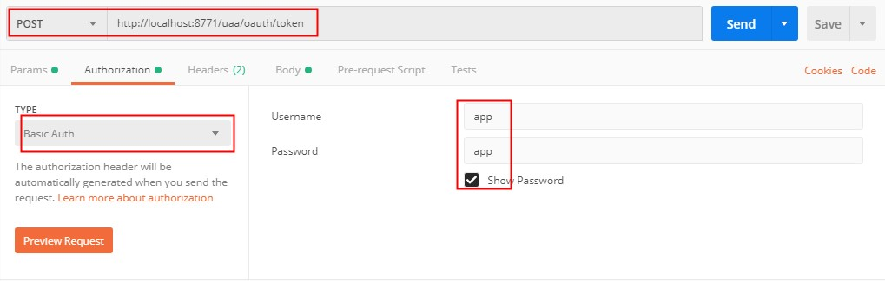
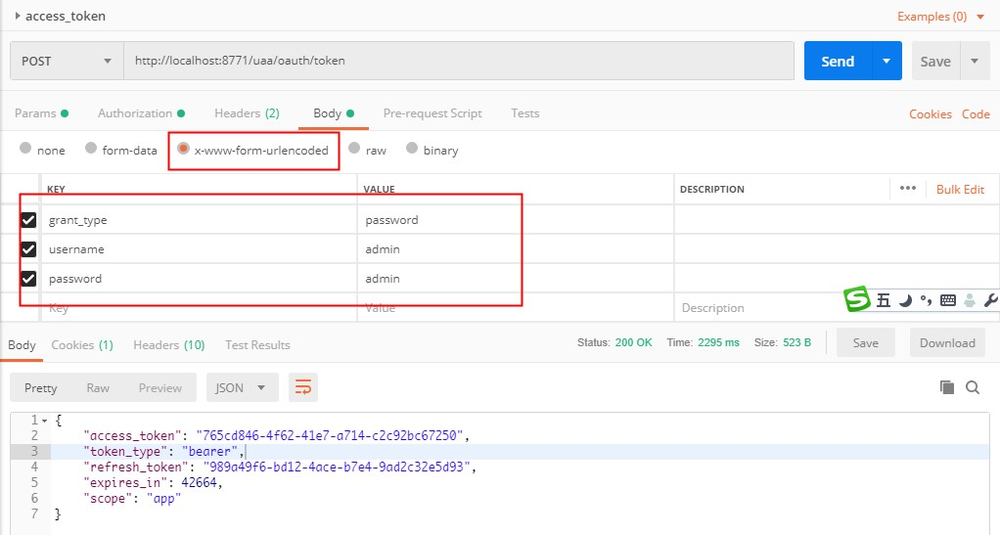
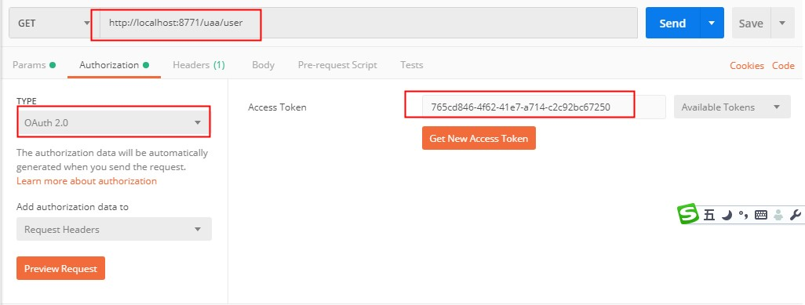
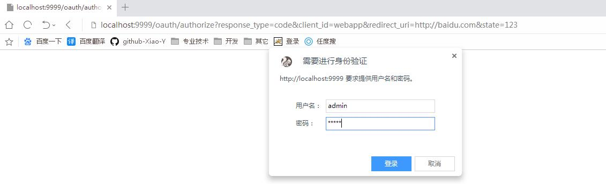
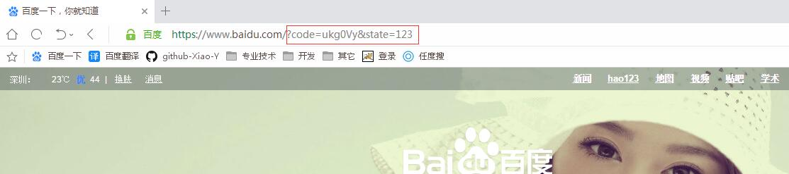
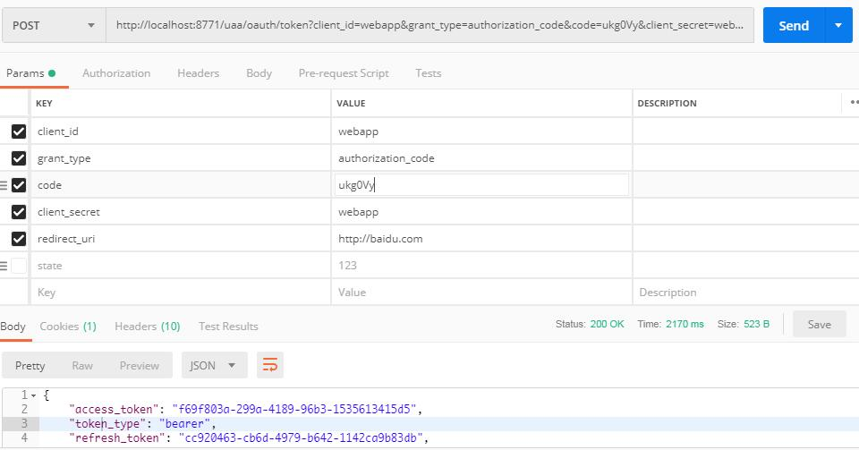
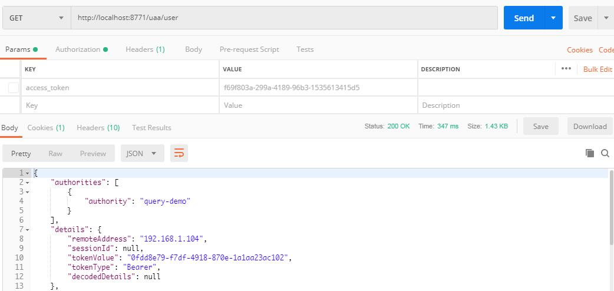
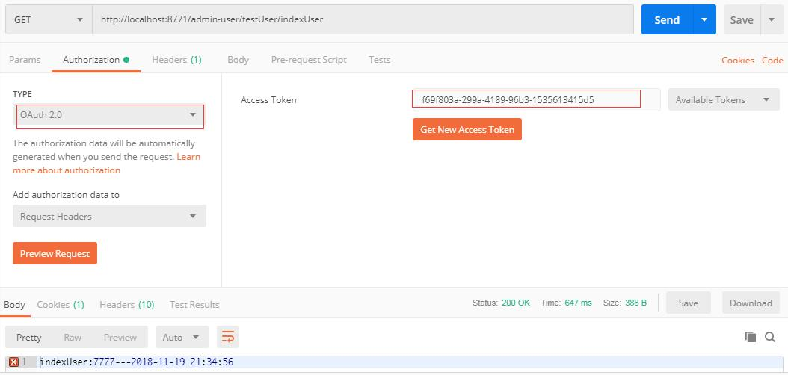

# springcloud 之 zuul、spring security、oauth2 的整合：
> zuul为微服务的网关，所有的访问服务的api都要通过网关转发到内网对应的服务。spring security、oauth2为认证和授权中心，负责整个微服务api的安全

#### 一、添加：learn-shop-public-auth 认证、授权中心
1、 在pom.xml中添加
```xml
<dependencies>
    <!-- 注册中心 -->
    <dependency>
        <groupId>org.springframework.cloud</groupId>
        <artifactId>spring-cloud-starter-eureka</artifactId>
    </dependency>
    <!-- spring security 相关 -->
    <dependency>
        <groupId>org.springframework.cloud</groupId>
        <artifactId>spring-cloud-starter-security</artifactId>
    </dependency>
    <dependency>
        <groupId>org.springframework.security</groupId>
        <artifactId>spring-security-data</artifactId>
    </dependency>
    <!-- oauth2 -->
    <dependency>
        <groupId>org.springframework.cloud</groupId>
        <artifactId>spring-cloud-starter-oauth2</artifactId>
    </dependency>
    <!-- spring data jpa -->
    <dependency>
        <groupId>org.springframework.boot</groupId>
        <artifactId>spring-boot-starter-data-jpa</artifactId>
    </dependency>
    <dependency>
        <groupId>org.springframework.boot</groupId>
        <artifactId>spring-boot-starter-web</artifactId>
    </dependency>
    <!-- redis：token 保存在redis中 -->
    <dependency>
        <groupId>org.springframework.boot</groupId>
        <artifactId>spring-boot-starter-data-redis</artifactId>
    </dependency>
    <!-- mysql驱动 -->
    <dependency>
        <groupId>mysql</groupId>
        <artifactId>mysql-connector-java</artifactId>
    </dependency>
    <!-- druid 连接池 -->
    <dependency>
        <groupId>com.alibaba</groupId>
        <artifactId>druid</artifactId>
    </dependency>
    <!-- json工具 -->
    <dependency>
        <groupId>com.alibaba</groupId>
        <artifactId>fastjson</artifactId>
    </dependency>
</dependencies>
```
2、添加配置文件


2.1. 认证服务：AuthorizationServerConfig.java
```java
import com.alibaba.druid.pool.DruidDataSource;
import com.billow.auth.security.DomainUserDetailsService;
import org.springframework.beans.factory.annotation.Autowired;
import org.springframework.context.annotation.Bean;
import org.springframework.context.annotation.Configuration;
import org.springframework.context.annotation.Primary;
import org.springframework.data.redis.connection.RedisConnectionFactory;
import org.springframework.security.authentication.AuthenticationManager;
import org.springframework.security.oauth2.config.annotation.configurers.ClientDetailsServiceConfigurer;
import org.springframework.security.oauth2.config.annotation.web.configuration.AuthorizationServerConfigurerAdapter;
import org.springframework.security.oauth2.config.annotation.web.configuration.EnableAuthorizationServer;
import org.springframework.security.oauth2.config.annotation.web.configurers.AuthorizationServerEndpointsConfigurer;
import org.springframework.security.oauth2.config.annotation.web.configurers.AuthorizationServerSecurityConfigurer;
import org.springframework.security.oauth2.provider.ClientDetailsService;
import org.springframework.security.oauth2.provider.client.JdbcClientDetailsService;
import org.springframework.security.oauth2.provider.token.DefaultTokenServices;
import org.springframework.security.oauth2.provider.token.TokenStore;
import org.springframework.security.oauth2.provider.token.store.redis.RedisTokenStore;


@Configuration
@EnableAuthorizationServer
public class AuthorizationServerConfig extends AuthorizationServerConfigurerAdapter {
    @Autowired
    private AuthenticationManager authenticationManager;
    @Autowired
    private DomainUserDetailsService domainUserDetailsService;
    @Autowired
    private DruidDataSource dataSource;
    @Autowired
    private RedisConnectionFactory connectionFactory;

    @Override
    public void configure(AuthorizationServerEndpointsConfigurer endpoints) throws Exception {
        endpoints
                .authenticationManager(authenticationManager)
                .userDetailsService(domainUserDetailsService)
                .tokenStore(getTokenStore())
                .tokenServices(defaultTokenServices());
    }

    @Override
    public void configure(AuthorizationServerSecurityConfigurer oauthServer) throws Exception {
        oauthServer
                .tokenKeyAccess("permitAll()")
                .checkTokenAccess("isAuthenticated()")
                .allowFormAuthenticationForClients();
    }

    @Override
    public void configure(ClientDetailsServiceConfigurer clients) throws Exception {
        // 客户端访问方式配置数据在数据库中
        clients.withClientDetails(clientDetails());
    }

    @Bean
    public ClientDetailsService clientDetails() {
        return new JdbcClientDetailsService(dataSource);
    }

    @Primary
    @Bean
    public DefaultTokenServices defaultTokenServices() {
        DefaultTokenServices tokenServices = new DefaultTokenServices();
        tokenServices.setTokenStore(getTokenStore());
        tokenServices.setSupportRefreshToken(true);
        tokenServices.setClientDetailsService(clientDetails());
        // token有效期自定义设置，默认12小时
        tokenServices.setAccessTokenValiditySeconds(60 * 60 * 12); 
        // 默认30天，这里修改
        tokenServices.setRefreshTokenValiditySeconds(60 * 60 * 24 * 7);
        return tokenServices;
    }

    @Bean
    public TokenStore getTokenStore() {
        return new RedisTokenStore(connectionFactory);
    }
}
```

2.2. 资源服务 ResourceServerConfig.java
```java
import org.springframework.context.annotation.Configuration;
import org.springframework.security.config.annotation.web.builders.HttpSecurity;
import org.springframework.security.oauth2.config.annotation.web.configuration.EnableResourceServer;
import org.springframework.security.oauth2.config.annotation.web.configuration.ResourceServerConfigurerAdapter;
import org.springframework.security.web.util.matcher.RequestMatcher;

import javax.servlet.http.HttpServletRequest;
import javax.servlet.http.HttpServletResponse;

@Configuration
@EnableResourceServer
public class ResourceServerConfig extends ResourceServerConfigurerAdapter {

    @Override
    public void configure(HttpSecurity http) throws Exception {
        http.csrf().disable()
                .exceptionHandling()
                .authenticationEntryPoint((request, response, authException) -> response.sendError(HttpServletResponse.SC_UNAUTHORIZED))
                .and()
                .authorizeRequests()
                .anyRequest().authenticated()
                .and()
                .httpBasic();
    }
}
```

2.3. spring security 的配置文件 WebSecurityConfig.java
```java
import org.springframework.beans.factory.annotation.Autowired;
import org.springframework.context.annotation.Bean;
import org.springframework.context.annotation.Configuration;
import org.springframework.security.authentication.AuthenticationManager;
import org.springframework.security.config.annotation.authentication.builders.AuthenticationManagerBuilder;
import org.springframework.security.config.annotation.web.builders.HttpSecurity;
import org.springframework.security.config.annotation.web.builders.WebSecurity;
import org.springframework.security.config.annotation.web.configuration.WebSecurityConfigurerAdapter;
import org.springframework.security.core.userdetails.UserDetailsService;
import org.springframework.security.crypto.password.PasswordEncoder;


@Configuration
public class WebSecurityConfig extends WebSecurityConfigurerAdapter {

    @Autowired
    private UserDetailsService userDetailsService;

    @Override
    protected void configure(AuthenticationManagerBuilder auth) throws Exception {
        auth
                .userDetailsService(userDetailsService)
                .passwordEncoder(passwordEncoder());
    }

    @Override
    @Bean
    public AuthenticationManager authenticationManagerBean() throws Exception {
        return super.authenticationManagerBean();
    }

    @Override
    protected void configure(HttpSecurity http) throws Exception {
        http
                .authorizeRequests()
                .anyRequest().authenticated()
                .and()
                .csrf().disable()
                .httpBasic();
    }

    @Override
    public void configure(WebSecurity web) throws Exception {
        web.ignoring().antMatchers("/favor.ioc");
    }

    @Bean
    public PasswordEncoder passwordEncoder() {
        // 密码加密
        // return new BCryptPasswordEncoder();
        // 不加密密码
        return new PasswordEncoder() {

            @Override
            public String encode(CharSequence charSequence) {
                return charSequence.toString();
            }

            @Override
            public boolean matches(CharSequence charSequence, String s) {
                return true;
            }
        };
    }
}

```

2.4. 实现登陆用户信息查询 DomainUserDetailsService.java
```java
import org.springframework.security.core.GrantedAuthority;
import org.springframework.security.core.authority.SimpleGrantedAuthority;
import org.springframework.security.core.userdetails.User;
import org.springframework.security.core.userdetails.UserDetails;
import org.springframework.security.core.userdetails.UserDetailsService;
import org.springframework.security.core.userdetails.UsernameNotFoundException;
import org.springframework.stereotype.Service;

import java.util.HashSet;
import java.util.Set;

@Service
public class DomainUserDetailsService implements UserDetailsService {

    @Override
    public UserDetails loadUserByUsername(String username) throws UsernameNotFoundException {
        // 查询用户的权限(我是写死的)
        Set<GrantedAuthority> userAuthotities = new HashSet<>();
        userAuthotities.add(new SimpleGrantedAuthority("query-demo"));
        // 注意如果在WebSecurityConfig.java 中使用的密文时，这个地方也要使用密文
        // return new User("admin", "$2a$10$XOVs4Z1YtPKqKwQVywG9j.xLAqXYRQLGZMGMrZDNbtl6pUC0Weteq", userAuthotities);
        return new User("admin", "admin", userAuthotities);
    }
}
```

2.5. 添加启动类 AuthServerApplication.java
```java
@SpringBootApplication
@EnableDiscoveryClient
public class AuthServerApplication {

    public static void main(String[] args) {
        SpringApplication.run(AuthServerApplication.class, args);
    }
}
```

2.6. 修改：application.yml（重要）
```yaml

....
security:
  oauth2:
    resource:
      filter-order: 3      
....

```
2.7. druid 和reids 的配置文件我就不贴了，网上多的是

3、 添加用户查询api UserController.java
```java
@RestController
public class UserController {

    @GetMapping("/user")
    public Principal user(Principal user) {
        return user;
    }
}
```

4、 oauth_client_details 为客户端访问方式
```sql

DROP TABLE IF EXISTS `oauth_client_details`;
CREATE TABLE `oauth_client_details`  (
  `client_id` varchar(48) CHARACTER SET utf8 COLLATE utf8_general_ci NOT NULL,
  `resource_ids` varchar(255) CHARACTER SET utf8 COLLATE utf8_general_ci NULL DEFAULT NULL,
  `client_secret` varchar(255) CHARACTER SET utf8 COLLATE utf8_general_ci NULL DEFAULT NULL,
  `scope` varchar(255) CHARACTER SET utf8 COLLATE utf8_general_ci NULL DEFAULT NULL,
  `authorized_grant_types` varchar(255) CHARACTER SET utf8 COLLATE utf8_general_ci NULL DEFAULT NULL,
  `web_server_redirect_uri` varchar(255) CHARACTER SET utf8 COLLATE utf8_general_ci NULL DEFAULT NULL,
  `authorities` varchar(255) CHARACTER SET utf8 COLLATE utf8_general_ci NULL DEFAULT NULL,
  `access_token_validity` int(11) NULL DEFAULT NULL,
  `refresh_token_validity` int(11) NULL DEFAULT NULL,
  `additional_information` varchar(4096) CHARACTER SET utf8 COLLATE utf8_general_ci NULL DEFAULT NULL,
  `autoapprove` varchar(255) CHARACTER SET utf8 COLLATE utf8_general_ci NULL DEFAULT NULL,
  PRIMARY KEY (`client_id`) USING BTREE
) ENGINE = InnoDB CHARACTER SET = utf8 COLLATE = utf8_general_ci ROW_FORMAT = Dynamic;

-- ----------------------------
-- Records of oauth_client_details
-- ----------------------------
INSERT INTO `oauth_client_details` VALUES ('app', NULL, 'app', 'app', 'password,refresh_token', NULL, NULL, NULL, NULL, NULL, NULL);
INSERT INTO `oauth_client_details` VALUES ('webapp', NULL, 'webapp', 'app', 'authorization_code,password,refresh_token,client_credentials', 'http://baidu.com', NULL, NULL, NULL, NULL, NULL);

```
#### 二、修改：learn-cloud-zuul


1、 在pom.xml中添加

```xml

....
<dependency>
    <groupId>org.springframework.cloud</groupId>
    <artifactId>spring-cloud-starter-security</artifactId>
</dependency>
<dependency>
    <groupId>org.springframework.cloud</groupId>
    <artifactId>spring-cloud-starter-oauth2</artifactId>
</dependency>
....

```

2、 配置文件中添加

2.1 修改 application.yml
```yaml
....

zuul:
  # 添加代理头
  add-proxy-headers: true
  # 敏感头信息（重要）
  sensitive-headers:
  routes:
    #服务认证和授权
    uaa:
      path: /uaa/**
      serviceId: learn-shop-public-auth
      
security:
  basic:
    enabled: false
  oauth2:
    client:
      access-token-uri: http://learn-shop-public-auth/uaa/oauth/token
      user-authorization-uri: http://learn-shop-public-auth/uaa/oauth/authorize
    resource:
      user-info-uri: http://learn-shop-public-auth/uaa/user
      prefer-token-info: false
management:
  security:
    enabled: false
    
.....

```

2.2. spring security 的配置文件 SecurityConfig.java
```java
@Configuration
@EnableWebSecurity
public class SecurityConfig extends WebSecurityConfigurerAdapter {

    @Override
    protected void configure(HttpSecurity http) throws Exception {
        http.csrf().disable();
    }
}
```

2.3. 在 ZuulApp.java 开启sso
添加：
```java
@EnableOAuth2Sso
```

#### 三、修改：learn-shop-admin-user
1、修改pom.xml 文件
```xml

....
<dependency>
    <groupId>org.springframework.cloud</groupId>
    <artifactId>spring-cloud-starter-security</artifactId>
</dependency>
<dependency>
    <groupId>org.springframework.cloud</groupId>
    <artifactId>spring-cloud-starter-oauth2</artifactId>
</dependency>
....

```

2、添加配置文件


2.1. 资源服务 ResourceServerConfig.java
```java
import org.springframework.context.annotation.Configuration;
import org.springframework.security.config.annotation.web.builders.HttpSecurity;
import org.springframework.security.oauth2.config.annotation.web.configuration.EnableResourceServer;
import org.springframework.security.oauth2.config.annotation.web.configuration.ResourceServerConfigurerAdapter;

import javax.servlet.http.HttpServletResponse;


@Configuration
@EnableResourceServer
public class ResourceServerConfig extends ResourceServerConfigurerAdapter {

    @Override
    public void configure(HttpSecurity http) throws Exception {
        http
                .csrf().disable()
                .exceptionHandling()
                .authenticationEntryPoint((request, response, authException) -> response.sendError(HttpServletResponse.SC_UNAUTHORIZED))
                .and()
                .authorizeRequests()
                .anyRequest().authenticated()
                .and()
                .httpBasic();
    }
}
```

2.2. 在 AdminUserApp 开启资源服务（控制方法的访问权限）
添加：
```java
@EnableGlobalMethodSecurity(prePostEnabled = true)
``` 

2.3. 修改 TestUserController.java 用于测试
```java
@RestController
@RequestMapping("/testUser")
public class TestUserController {

    @GetMapping("/indexUser")
    @PreAuthorize("hasAuthority('query-demo')")
    public String indexUser() {
        System.out.println("indexUser: " + name);
        return "indexUser:---" + DateUtil.now();
    }

    @GetMapping("/findAll")
    @PreAuthorize("hasAuthority('query-findAll')")
    public String findAll() {
        return "findAll:---" + DateUtil.now();
    }

    @PostMapping("/saveUser")
    public String saveUser() {
        return "saveUser:---" + DateUtil.now();
    }
}

```

#### 四、测试（使用 postmen）

1、 password 模式：








2、authorization_code 模式：


2.1、在浏览器中访问：

http://localhost:8771/uaa/oauth/authorize?response_type=code&client_id=webapp&redirect_uri=http://baidu.com&state=123

获取 code






2.2、postmen中post 访问：

http://localhost:8771/uaa/oauth/token?client_id=webapp&grant_type=authorization_code&code=ukg0Vy&client_secret=webapp&redirect_uri=http://baidu.com

获取 access_token





