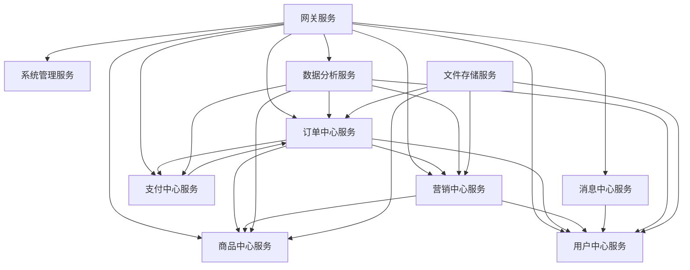

# Learn Shop 商城系统微服务架构需求文档

## 1. 项目概述

### 1.1 项目背景
Learn Shop是一个基于Spring Cloud微服务架构的电商系统，用于学习和实践微服务架构设计。系统采用前后端分离设计，包含商品管理、订单管理、购物车、促销、搜索等核心功能模块。

### 1.2 技术栈
- **后端框架**: Spring Boot 3.3.1, Spring Cloud 2023.0.3, Spring Cloud Alibaba 2023.0.3.2
- **数据库**: MySQL 8+, MyBatis Flex 1.11.3
- **缓存**: Redis 6.0+, Redisson 3.45.1
- **消息队列**: RabbitMQ 3.8+
- **注册中心**: Nacos 2.0+
- **网关**: Spring Cloud Gateway
- **对象存储**: MinIO
- **链路追踪**: SkyWalking
- **前端**: Vue 3.x + Element Plus (后台), Vue 3.x + Vant (移动端)

### 1.3 架构原则
- 业务驱动的服务拆分
- 数据一致性保证
- 高可用和高性能
- 可扩展和可维护

## 2. 现状分析

### 2.1 已实现服务模块

#### 2.1.1 基础设施层
| 服务名称 | 端口 | 状态 | 功能描述 |
|---------|------|------|----------|
| Nacos | 8761 | ✅ 已实现 | 注册中心、配置中心 |
| learn-cloud-gateway | 8771 | ✅ 已实现 | 路由网关、鉴权 |
| learn-cloud-common | - | ✅ 已实现 | 配置中心公共模块 |

#### 2.1.2 基础组件层 (learn-shop-base)
| 组件名称 | 状态 | 功能描述 |
|---------|------|----------|
| learn-shop-base-aop | ✅ 已实现 | 统一返回、异常处理、日志 |
| learn-shop-base-common | ✅ 已实现 | MQ、Redis、Swagger配置 |
| learn-shop-base-email | ✅ 已实现 | 邮件服务组件 |
| learn-shop-base-excel | ✅ 已实现 | Excel导入导出 |
| learn-shop-base-job | ✅ 已实现 | 定时任务组件 |
| learn-shop-base-mybatis | ✅ 已实现 | MyBatis配置、代码生成 |
| learn-shop-base-notice | ✅ 已实现 | 消息通知组件 |
| learn-shop-base-redis | ✅ 已实现 | Redis配置、分布式锁 |
| learn-shop-base-security | ✅ 已实现 | 安全组件、认证授权 |
| learn-shop-base-tools | ✅ 已实现 | 通用工具类 |
| learn-shop-base-workflow | ✅ 已实现 | 工作流组件 |

#### 2.1.3 业务服务层
| 服务名称 | 端口 | 状态 | 功能描述 |
|---------|------|------|----------|
| learn-shop-admin-system | 8811 | ✅ 已实现 | 系统管理服务 |
| learn-shop-core-product | 8911 | ✅ 已实现 | 商品服务 |
| learn-shop-core-order | 8901 | ✅ 已实现 | 订单服务 |
| learn-shop-core-cart | - | 🔄 部分实现 | 购物车服务 |
| learn-shop-core-file | - | ✅ 已实现 | 文件服务 |
| learn-shop-core-search | 8981 | 🔄 部分实现 | 搜索服务 |
| learn-shop-core-promotion | 8921 | 🔄 部分实现 | 促销服务 |
| learn-shop-app | 8089 | 🔄 部分实现 | APP端服务 |

#### 2.1.4 前端应用
| 应用名称 | 状态 | 功能描述 |
|---------|------|----------|
| learn-shop-ui-admin | ✅ 已实现 | 后台管理前端 |
| learn-shop-ui-app | ✅ 已实现 | 移动端应用 |

### 2.2 问题分析

#### 2.2.1 服务拆分过细的问题
1. **购物车服务独立性过强**: 购物车与订单、商品联系紧密，独立服务增加了复杂性
2. **搜索服务职责单一**: 仅负责搜索功能，可以合并到商品服务
3. **促销服务边界模糊**: 促销逻辑与订单、商品关联度高
4. **文件服务过于独立**: 文件管理可以作为基础组件提供

#### 2.2.2 缺失的核心功能
1. **用户中心服务**: 用户管理、会员体系、积分系统
2. **支付服务**: 支付接口、支付回调、退款处理
3. **库存服务**: 库存管理、预占、扣减
4. **营销服务**: 优惠券、活动管理、推荐系统
5. **数据分析服务**: 统计分析、报表生成
6. **消息服务**: 站内信、推送通知

## 3. 优化后的服务架构

### 3.1 服务重新规划

#### 3.1.1 核心业务服务 (端口: 89xx)
| 服务名称 | 端口 | 职责范围 | 优化说明 |
|---------|------|----------|----------|
| **商品中心服务** | 8910 | 商品管理、分类管理、规格管理、库存管理、商品搜索 | 合并原商品服务+搜索服务+库存管理 |
| **订单中心服务** | 8920 | 订单管理、购物车、结算、订单状态流转 | 合并原订单服务+购物车服务 |
| **用户中心服务** | 8930 | 用户管理、会员体系、积分管理、用户画像 | 新增核心服务 |
| **营销中心服务** | 8940 | 促销活动、优惠券、推荐系统、营销工具 | 重构原促销服务 |
| **支付中心服务** | 8950 | 支付处理、退款管理、账单管理、风控 | 新增核心服务 |
| **消息中心服务** | 8960 | 站内信、推送通知、消息模板、消息队列 | 新增核心服务 |

#### 3.1.2 管理支撑服务 (端口: 88xx)
| 服务名称 | 端口 | 职责范围 |
|---------|------|----------|
| **系统管理服务** | 8810 | 系统配置、菜单权限、角色管理、字典管理 |
| **数据分析服务** | 8820 | 统计分析、报表生成、数据可视化、业务监控 |

#### 3.1.3 基础服务层
| 服务名称 | 端口 | 职责范围 |
|---------|------|----------|
| **文件存储服务** | 8800 | 文件上传、存储、CDN、图片处理 |
| **网关服务** | 8771 | 路由转发、认证鉴权、限流熔断、日志记录 |

### 3.2 服务依赖关系



## 4. 详细需求规格

### 4.1 商品中心服务

#### 4.1.1 功能模块
- **商品管理**: 商品CRUD、商品状态管理、商品审核
- **分类管理**: 商品分类、属性管理、品牌管理
- **规格管理**: SKU管理、规格组合、价格管理
- **库存管理**: 库存查询、预占、扣减、补货提醒
- **搜索功能**: 商品搜索、筛选、排序、推荐

#### 4.1.2 核心接口
```
GET  /product/list          # 商品列表
GET  /product/{id}          # 商品详情
POST /product               # 创建商品
PUT  /product/{id}          # 更新商品
GET  /product/search        # 商品搜索
POST /inventory/reserve     # 库存预占
POST /inventory/release     # 库存释放
```

#### 4.1.3 数据模型
- 商品基础信息表 (product_info)
- 商品SKU表 (product_sku)
- 商品分类表 (product_category)
- 库存信息表 (inventory_info)
- 搜索索引 (Elasticsearch)

### 4.2 订单中心服务

#### 4.1.1 功能模块
- **购物车管理**: 添加商品、修改数量、删除商品、结算
- **订单管理**: 订单创建、支付、发货、收货、退款
- **订单流程**: 订单状态机、超时处理、异常处理
- **物流管理**: 物流跟踪、配送管理

#### 4.1.2 核心接口
```
POST /cart/add              # 添加到购物车
GET  /cart/list             # 购物车列表
POST /order/create          # 创建订单
GET  /order/{id}            # 订单详情
PUT  /order/{id}/pay        # 订单支付
PUT  /order/{id}/ship       # 订单发货
```

#### 4.1.3 数据模型
- 购物车表 (cart_info, cart_item)
- 订单主表 (order_info)
- 订单明细表 (order_item)
- 物流信息表 (logistics_info)

### 4.3 用户中心服务

#### 4.3.1 功能模块
- **用户管理**: 用户注册、登录、资料管理、实名认证
- **会员体系**: 会员等级、成长值、权益管理
- **积分系统**: 积分获取、消费、兑换、过期处理
- **地址管理**: 收货地址、默认地址设置
- **用户画像**: 行为分析、偏好标签、推荐基础

#### 4.3.2 核心接口
```
POST /user/register         # 用户注册
POST /user/login            # 用户登录
GET  /user/profile          # 用户资料
POST /user/address          # 添加地址
GET  /user/points           # 积分查询
POST /user/points/consume   # 积分消费
```

### 4.4 营销中心服务

#### 4.4.1 功能模块
- **促销活动**: 满减、折扣、秒杀、拼团活动
- **优惠券系统**: 优惠券发放、使用、核销
- **推荐系统**: 商品推荐、个性化推荐
- **营销工具**: A/B测试、营销数据分析

#### 4.4.2 核心接口
```
GET  /promotion/list        # 促销活动列表
POST /coupon/issue          # 发放优惠券
POST /coupon/use            # 使用优惠券
GET  /recommend/products    # 商品推荐
```

### 4.5 支付中心服务

#### 4.5.1 功能模块
- **支付处理**: 支付宝、微信、银联等支付方式
- **退款管理**: 退款申请、退款处理、退款查询
- **账单管理**: 交易记录、对账、清算
- **风控系统**: 风险识别、反欺诈、限额控制

#### 4.5.2 核心接口
```
POST /payment/create        # 创建支付
POST /payment/callback      # 支付回调
POST /refund/apply          # 申请退款
GET  /payment/status        # 支付状态查询
```

### 4.6 消息中心服务

#### 4.6.1 功能模块
- **站内消息**: 系统通知、订单消息、营销消息
- **推送通知**: APP推送、短信通知、邮件通知
- **消息模板**: 模板管理、变量替换、多语言支持
- **消息队列**: 异步消息处理、消息重试、死信处理

#### 4.6.2 核心接口
```
POST /message/send          # 发送消息
GET  /message/list          # 消息列表
PUT  /message/{id}/read     # 标记已读
POST /notification/push     # 推送通知
```

## 5. 数据架构设计

### 5.1 数据库分库分表策略

#### 5.1.1 商品中心
- **分库策略**: 按商品分类分库 (category_id % 4)
- **分表策略**: 商品表按创建时间分表 (按月)

#### 5.1.2 订单中心
- **分库策略**: 按用户ID分库 (user_id % 8)
- **分表策略**: 订单表按创建时间分表 (按月)

#### 5.1.3 用户中心
- **分库策略**: 按用户ID分库 (user_id % 4)
- **分表策略**: 用户行为日志按时间分表 (按天)

### 5.2 缓存架构

#### 5.2.1 Redis使用规范
```
# 商品信息缓存
product:info:{productId}        # 商品基础信息
product:sku:{skuId}            # SKU信息
product:inventory:{skuId}      # 库存信息

# 用户相关缓存
user:info:{userId}             # 用户基础信息
user:session:{token}           # 用户会话
cart:items:{userId}            # 购物车信息

# 营销相关缓存
promotion:active               # 活动促销信息
coupon:user:{userId}          # 用户优惠券
```

## 6. 技术实现方案

### 6.1 分布式事务处理

#### 6.1.1 Saga模式
- **订单创建流程**: 库存预占 → 订单创建 → 支付处理 → 库存扣减
- **补偿机制**: 每个步骤都有对应的补偿操作
- **状态管理**: 使用状态机管理事务状态

#### 6.1.2 最终一致性
- **异步消息**: 使用RabbitMQ保证消息可靠传递
- **重试机制**: 指数退避重试策略
- **幂等性**: 接口幂等性设计

### 6.2 性能优化方案

#### 6.2.1 缓存策略
- **多级缓存**: 本地缓存 + Redis + CDN
- **缓存预热**: 系统启动时预加载热点数据
- **缓存更新**: 采用延迟双删策略

#### 6.2.2 数据库优化
- **读写分离**: 主库写入，从库读取
- **连接池优化**: HikariCP连接池配置
- **SQL优化**: 慢查询监控和优化

### 6.3 监控告警体系

#### 6.3.1 应用监控
- **链路追踪**: SkyWalking全链路监控
- **性能监控**: 接口响应时间、吞吐量
- **错误监控**: 异常统计、错误率告警

#### 6.3.2 基础设施监控
- **服务器监控**: CPU、内存、磁盘、网络
- **中间件监控**: Redis、MySQL、RabbitMQ状态
- **业务监控**: 订单量、支付成功率、用户活跃度

## 7. 开发计划

### 7.1 第一阶段 (1-2个月)
- [ ] 重构商品中心服务 (合并搜索功能)
- [ ] 重构订单中心服务 (合并购物车功能)
- [ ] 完善文件存储服务
- [ ] 优化基础组件

### 7.2 第二阶段 (2-3个月)
- [ ] 开发用户中心服务
- [ ] 开发支付中心服务
- [ ] 重构营销中心服务
- [ ] 完善数据分析服务

### 7.3 第三阶段 (1-2个月)
- [ ] 开发消息中心服务
- [ ] 完善监控告警体系
- [ ] 性能优化和压力测试
- [ ] 文档完善和培训

### 7.4 第四阶段 (持续)
- [ ] 功能迭代和优化
- [ ] 新技术引入和实践
- [ ] 架构演进和重构

## 8. 风险评估

### 8.1 技术风险
- **服务拆分复杂度**: 需要合理规划服务边界
- **数据一致性**: 分布式事务处理复杂
- **性能瓶颈**: 需要持续优化和监控

### 8.2 业务风险
- **功能完整性**: 确保核心业务功能不缺失
- **用户体验**: 服务拆分不能影响用户体验
- **数据安全**: 用户数据和交易数据安全

### 8.3 运维风险
- **服务治理**: 微服务数量增加带来的运维复杂度
- **故障处理**: 分布式系统故障定位和处理
- **容量规划**: 服务扩容和资源规划

## 9. 总结

本需求文档基于现有系统分析，提出了优化的微服务架构方案：

1. **服务合并优化**: 将过细的服务进行合理合并，减少系统复杂度
2. **功能补全**: 补充缺失的核心业务功能，形成完整的电商体系
3. **架构升级**: 采用更合理的服务划分和技术架构
4. **可扩展性**: 为未来业务发展预留扩展空间

通过这次重构，系统将更加稳定、高效、易维护，为业务发展提供强有力的技术支撑。